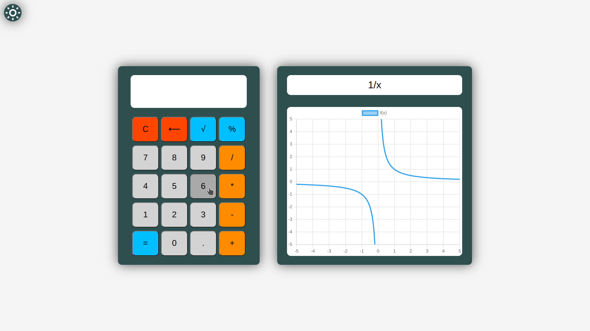
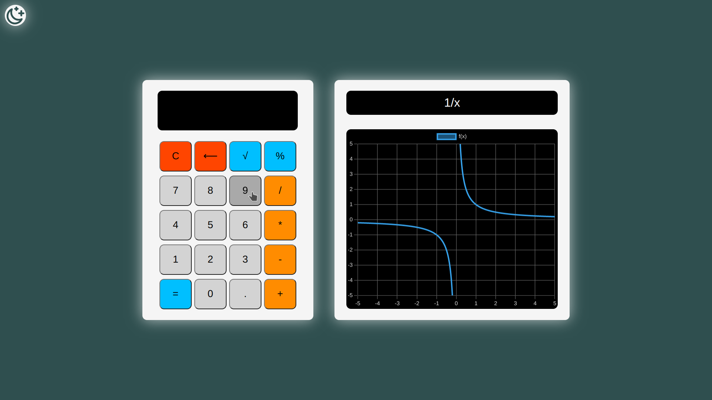

# Web calculator

This is a simple web calculator I made as part of a tiny school project that can perform basic arithmetic operations and plot functions with HTML, CSS, Javascript & [Chart.js](https://www.chartjs.org/).

You can try the calculator [here](https://BayDevCodes.github.io/web-calculator/).

## Features

### Numerical calculator
- Basic operations (+,-,*,/)
- Decimal point (.)
- Percentage calculation (%)
- Square root (√)
- Clear and backspace (C, ⟵)
- Opposite sign with the "o" key
- Chain operations on the result
- Keyboard support (numbers, operators...)
- Error handling (division by zero, wrong domain...)

### Graphing calculator
- Function input
- Expression parsing & sanitization
- Feedback on expression syntax
- Plotting of the function
- Transitions between plots

### Dark mode
You can switch between light and dark mode with a nice transition by clicking the icon in the top right corner.

## Usage

You can use the calculator by clicking the buttons with your mouse or by using your keyboard. The calculator supports the following keyboard shortcuts:

- Numbers: 0-9
- Operators: +, -, *, /, o (opposite sign), =
- Decimal point: .
- Delete: ⟵
- Clear: C

## License

This project is licensed under the [MIT License](./LICENSE).
